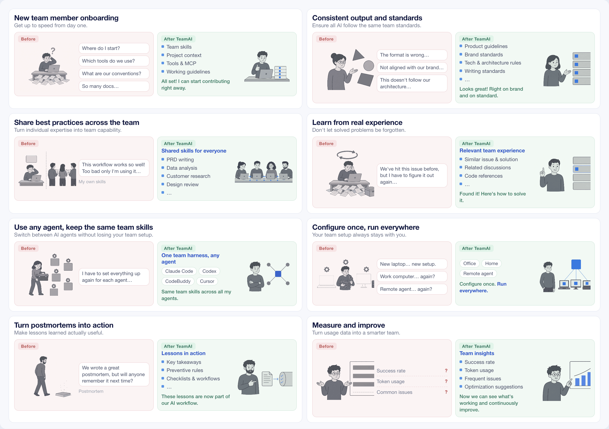

<p align="center">
  
</p>

<h1 align="center">TeamAI — Make Every Team AI Native</h1>

<p align="center">
  <a href="https://trendshift.io/repositories/123184?utm_source=repository-badge&amp;utm_medium=badge&amp;utm_campaign=badge-repository-123184" target="_blank" rel="noopener noreferrer"></a>
</p>

<p align="center">
  <a href="README.md">English</a> | <a href="README.zh-CN.md">中文</a> | <a href="README.ja.md">日本語</a> | <a href="README.ko.md">한국어</a> | <a href="README.th.md">ไทย</a>
</p>

<p align="center">
  <a href="https://github.com/Tencent/teamai-cli/actions/workflows/ci.yml"></a>
  <a href="https://www.npmjs.com/package/teamai-cli"></a>
  <a href="https://www.npmjs.com/package/teamai-cli"></a>
  <a href="LICENSE"></a>
</p>

**The shared foundation for how your team works, learns, and improves with AI.**

TeamAI turns individual AI capabilities into shared team capabilities — across agents, machines, and team members.

## Why TeamAI

<p align="center">
  
</p>

## Quick Start

Send this one line to your AI tool:

```text
Install the teamai skill: https://github.com/Tencent/teamai-cli/tree/main/skills/teamai , load the teamai skill, then set up TeamAI for my team from scratch.
```

Once TeamAI is set up, just talk to the `/teamai` skill in your AI tool:

**Set up a team from scratch**

```text
/teamai Help me set up TeamAI for my team from scratch
```

**Join a team**

```text
/teamai Help me join my team's TeamAI, repo URL is https://github.com/your-org/your-repo
```

**Share with the team**

Skills, rules, MCP servers, and other agent resources can all be shared:

```text
/teamai Share my xxx skill with the team
```

**Open the dashboard**

```text
/teamai Open the TeamAI dashboard
```

Once a teammate is set up, they just open their agent and already have the team's full set of AI assets.

<details>
<summary>Command-line install</summary>

### Install

```bash
npm install -g teamai-cli
```

### Team admin / solo user

Create a shared-experience repo on your git host (GitHub, GitLab, GitCode, CNB, TGit, or a private Git service), **grant write access to team members**, then run `teamai init https://github.com/your-org/your-repo`.

> **No team repo yet?** Start from a template pre-loaded with production-ready skills, rules, and review agents. Browse the [teamai-hub](https://github.com/teamai-hub) org, click **Fork**, then `teamai init` against your new repo.

### Team members

```bash
# Choose one, depending on where you want resources installed

# Project-scope init (default, resources installed under the project directory)
cd /path/to/my-project
teamai init https://github.com/your-org/your-repo

# Or, user-scope init (resources installed under ~/)
teamai init https://github.com/your-org/your-repo --scope user
```

Once initialized, every AI session automatically pulls the latest skills / rules and other Harness updates published by admins — no manual sync needed.

</details>

## Product Overview

Three layers of capability, built on Git:

- **Team Execution** — make every agent work the team's way: skills, rules, docs, env, agents, hooks, MCP.
- **Team Context** (beta) — make every agent understand the team: learnings, codebase graph, teamwiki.
- **Team Improvement** (beta) — make every execution improve the team: usage, sessions, dashboard.

<table>
  <thead>
    <tr>
      <th rowspan="2">Agent</th>
      <th colspan="7">Team Execution</th>
      <th colspan="3">Team Context (beta)</th>
      <th colspan="3">Team Improvement (beta)</th>
    </tr>
    <tr>
      <th>skills</th><th>rules</th><th>docs</th><th>env</th><th>agents</th><th>hooks</th><th>mcp</th>
      <th>learnings</th><th>codebase</th><th>teamwiki</th>
      <th>usage</th><th>sessions</th><th>dashboard</th>
    </tr>
  </thead>
  <tbody>
    <tr><td>Claude Code</td><td align="center">✓</td><td align="center">✓</td><td align="center">✓</td><td align="center">✓</td><td align="center">✓</td><td align="center">✓</td><td align="center">✓</td><td align="center">✓</td><td align="center">✓</td><td align="center">✓</td><td align="center">✓</td><td align="center">✓</td><td align="center">✓</td></tr>
    <tr><td>Codex</td><td align="center">✓</td><td align="center">✓</td><td align="center">✓</td><td align="center">✓</td><td align="center">✓</td><td align="center">✓</td><td align="center">✓</td><td align="center">✓</td><td align="center">✓</td><td align="center">✓</td><td align="center">✓</td><td align="center">✓</td><td align="center">✓</td></tr>
    <tr><td>Cursor</td><td align="center">✓</td><td align="center">✓</td><td align="center">✓</td><td align="center">✓</td><td align="center">✓</td><td align="center">✓</td><td align="center">✓</td><td align="center">✓</td><td align="center">✓</td><td align="center">✓</td><td align="center">✓</td><td align="center">✓</td><td align="center">✓</td></tr>
    <tr><td>GitHub Copilot CLI</td><td align="center">✓</td><td align="center">✓</td><td align="center">✓</td><td align="center">✓</td><td align="center">✓</td><td align="center">✓</td><td align="center">✓</td><td align="center">✓</td><td align="center">✓</td><td align="center">✓</td><td align="center">✓</td><td align="center">✓</td><td align="center">✓</td></tr>
    <tr><td>CodeBuddy</td><td align="center">✓</td><td align="center">✓</td><td align="center">✓</td><td align="center">✓</td><td align="center">✓</td><td align="center">✓</td><td align="center">✓</td><td align="center">✓</td><td align="center">✓</td><td align="center">✓</td><td align="center">✓</td><td align="center">✓</td><td align="center">✓</td></tr>
    <tr><td>WorkBuddy</td><td align="center">✓</td><td align="center">✓</td><td align="center">✓</td><td align="center">✓</td><td align="center">—</td><td align="center">✓</td><td align="center">✓</td><td align="center">✓</td><td align="center">✓</td><td align="center">✓</td><td align="center">✓</td><td align="center">✓</td><td align="center">✓</td></tr>
    <tr><td>OpenCode</td><td align="center">✓</td><td align="center">✓</td><td align="center">✓</td><td align="center">✓</td><td align="center">✓</td><td align="center">✓</td><td align="center">✓</td><td align="center">✓</td><td align="center">✓</td><td align="center">✓</td><td align="center">—</td><td align="center">—</td><td align="center">—</td></tr>
    <tr><td>Pi Coding Agent</td><td align="center">✓</td><td align="center">✓</td><td align="center">✓</td><td align="center">—</td><td align="center">—</td><td align="center">✓</td><td align="center">—</td><td align="center">—</td><td align="center">—</td><td align="center">—</td><td align="center">—</td><td align="center">—</td><td align="center">—</td></tr>
    <tr><td>OpenClaw</td><td align="center">✓</td><td align="center">✓</td><td align="center">✓</td><td align="center">✓</td><td align="center">—</td><td align="center">—</td><td align="center">—</td><td align="center">✓</td><td align="center">✓</td><td align="center">✓</td><td align="center">—</td><td align="center">—</td><td align="center">—</td></tr>
    <tr><td>Hermes</td><td align="center">✓</td><td align="center">—</td><td align="center">✓</td><td align="center">✓</td><td align="center">—</td><td align="center">—</td><td align="center">—</td><td align="center">✓</td><td align="center">✓</td><td align="center">✓</td><td align="center">—</td><td align="center">—</td><td align="center">—</td></tr>
    <tr><td>DeepSeek Harness</td><td align="center">✓</td><td align="center">—</td><td align="center">✓</td><td align="center">—</td><td align="center">—</td><td align="center">—</td><td align="center">—</td><td align="center">✓</td><td align="center">✓</td><td align="center">✓</td><td align="center">—</td><td align="center">—</td><td align="center">—</td></tr>
    <tr><td>Qoder</td><td align="center">✓</td><td align="center">✓</td><td align="center">✓</td><td align="center">✓</td><td align="center">✓</td><td align="center">✓</td><td align="center">✓</td><td align="center">✓</td><td align="center">✓</td><td align="center">✓</td><td align="center">✓</td><td align="center">✓</td><td align="center">✓</td></tr>
    <tr><td>Qoder CN</td><td align="center">✓</td><td align="center">✓</td><td align="center">✓</td><td align="center">✓</td><td align="center">✓</td><td align="center">✓</td><td align="center">✓</td><td align="center">✓</td><td align="center">✓</td><td align="center">✓</td><td align="center">✓</td><td align="center">✓</td><td align="center">✓</td></tr>
    <tr><td>Kiro</td><td align="center">✓</td><td align="center">✓</td><td align="center">✓</td><td align="center">✓</td><td align="center">✓</td><td align="center">✓</td><td align="center">✓</td><td align="center">✓</td><td align="center">✓</td><td align="center">✓</td><td align="center">✓</td><td align="center">✓</td><td align="center">✓</td></tr>
    <tr><td>ZCode</td><td align="center">✓</td><td align="center">—</td><td align="center">✓</td><td align="center">—</td><td align="center">✓</td><td align="center">✓</td><td align="center">✓</td><td align="center">✓</td><td align="center">✓</td><td align="center">✓</td><td align="center">✓</td><td align="center">✓</td><td align="center">✓</td></tr>
    <tr><td>Oh My Pi</td><td align="center">✓</td><td align="center">✓</td><td align="center">✓</td><td align="center">✓</td><td align="center">✓</td><td align="center">✓</td><td align="center">✓</td><td align="center">✓</td><td align="center">✓</td><td align="center">✓</td><td align="center">—</td><td align="center">—</td><td align="center">—</td></tr>
  </tbody>
</table>

## Learn More

- [Usage Guide](docs/usage-guide.md) ([中文版](docs/usage-guide.zh-CN.md)) — setup, onboarding, daily workflows, and commands
- [Product Overview](docs/product-overview.md) ([中文版](docs/product-overview.zh-CN.md)) — architecture, distribution controls, and capability details
- [Git Providers](docs/providers.md) — supported repository providers
- [Windows Setup](docs/windows-hooks.md) ([中文版](docs/windows-hooks.zh-CN.md)) — hooks and shell configuration
- [Technical Designs](docs/designs/) — design documents and proposals

## Contributors

Thanks to everyone who has contributed to TeamAI!

<a href="https://github.com/Tencent/teamai-cli/graphs/contributors">
  
</a>

Made with [contrib.rocks](https://contrib.rocks).

## Contributing

Join the conversation, or open an issue or PR. See [CONTRIBUTING.md](.github/CONTRIBUTING.md) for how to contribute.

## License

[MIT](LICENSE)
