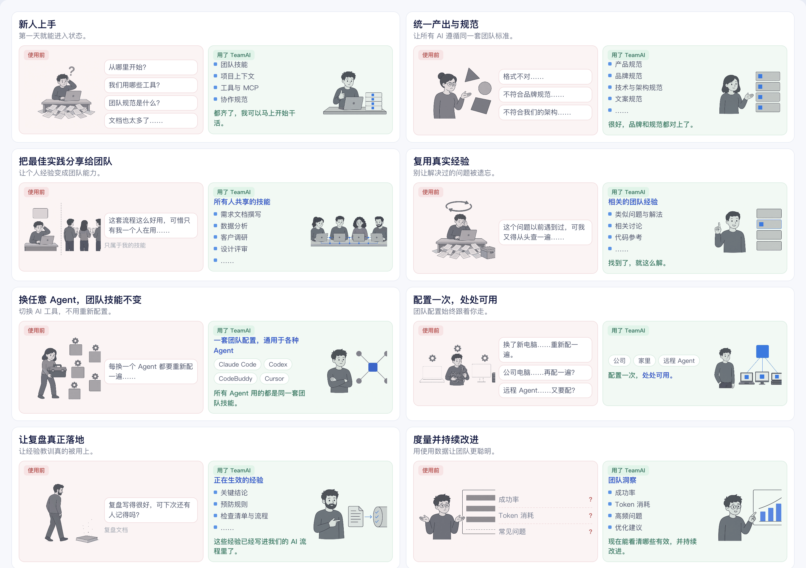

<p align="center">
  
</p>

<h1 align="center">TeamAI — Make Every Team AI Native</h1>

<p align="center">
  <a href="https://trendshift.io/repositories/123184?utm_source=repository-badge&amp;utm_medium=badge&amp;utm_campaign=badge-repository-123184" target="_blank" rel="noopener noreferrer"></a>
</p>

<p align="center">
  <a href="README.md">English</a> | <a href="README.zh-CN.md">中文</a> | <a href="README.ja.md">日本語</a> | <a href="README.ko.md">한국어</a> | <a href="README.th.md">ไทย</a>
</p>

<p align="center">
  <a href="https://github.com/Tencent/teamai-cli/actions/workflows/ci.yml"></a>
  <a href="https://www.npmjs.com/package/teamai-cli"></a>
  <a href="https://www.npmjs.com/package/teamai-cli"></a>
  <a href="LICENSE"></a>
</p>

**为团队构建共享的 AI 基础，统一协作方式、沉淀团队上下文，并持续改进。**

TeamAI 将个人的 AI 能力转化为团队共享能力，并在不同 Agent、设备和团队成员之间复用。

## 为什么选择 TeamAI

<p align="center">
  
</p>

## 快速开始

把下面这一句发给你的 AI 工具:

```text
帮我装好 teamai skill : https://github.com/Tencent/teamai-cli/tree/main/skills/teamai , 加载 teamai skill, 然后从零搭建团队的 TeamAI。
```

如无法访问 GitHub，改用下面这一句:

```text
请根据 https://skillhub.cn/install/skillhub.md，安装 @user_7be6e993/teamai。然后加载 teamai skill, 并从零初始化我的团队 teamai。
```

装好 TeamAI 后,在 AI 工具里直接跟 `/teamai` 对话就行:

**从零搭建团队**

```text
/teamai 帮我从零搭建团队的 TeamAI
```

**加入团队**

```text
/teamai 帮我加入团队的 TeamAI,仓库地址是 https://github.com/your-org/your-repo
```

**把资源分享给团队**

Skills、Rules、MCP 等 Agent 能用的资源都可以分享：

```text
/teamai 帮我把 xxx skill 分享给团队
```

**打开团队看板**

```text
/teamai 帮我打开 TeamAI 看板
```

团队成员完成接入后，打开 Agent 即可使用团队的全部 AI 资产。

<details>
<summary>命令行安装</summary>

### 安装

```bash
npm install -g teamai-cli
```

### 团队管理员 / 个人使用者

在 Git 托管平台（GitHub、GitLab、GitCode、CNB、TGit，或私有 Git 服务）创建共享经验仓库，**授予团队成员写权限**，然后运行 `teamai init https://github.com/your-org/your-repo`。

> **还没有团队仓库？** 可以从内置了成套 skills、rules、review agents 的模板起步。浏览 [teamai-hub](https://github.com/teamai-hub) org，点 **Fork** 生成自己的仓库，再对它执行 `teamai init`。

### 团队成员

```bash
# 二选一：按你想要的安装范围选择其中一条

# 项目级初始化（默认，资源安装到项目目录下）
cd /path/to/my-project
teamai init https://github.com/your-org/your-repo

# 或者，用户级初始化（资源安装到 ~/ 下）
teamai init https://github.com/your-org/your-repo --scope user
```

初始化完成后，每次开启 AI 会话时都会自动拉取管理员发布的 skills / rules 等 Harness 更新，无需手动同步。

</details>

## 产品概览

基于 Git 打造三层能力：

- **Team Execution** —— 让每个 Agent 按团队的方式工作：skills、rules、docs、env、agents、hooks、MCP。
- **Team Context**（beta）—— 让每个 Agent 理解整个团队：learnings、代码知识图谱、teamwiki。
- **Team Improvement**（beta）—— 让每一次执行都沉淀为团队能力：usage、sessions、dashboard。

<table>
  <thead>
    <tr>
      <th rowspan="2">Agent</th>
      <th colspan="7">Team Execution</th>
      <th colspan="3">Team Context (beta)</th>
      <th colspan="3">Team Improvement (beta)</th>
    </tr>
    <tr>
      <th>skills</th><th>rules</th><th>docs</th><th>env</th><th>agents</th><th>hooks</th><th>mcp</th>
      <th>learnings</th><th>codebase</th><th>teamwiki</th>
      <th>usage</th><th>sessions</th><th>dashboard</th>
    </tr>
  </thead>
  <tbody>
    <tr><td>Claude Code</td><td align="center">✓</td><td align="center">✓</td><td align="center">✓</td><td align="center">✓</td><td align="center">✓</td><td align="center">✓</td><td align="center">✓</td><td align="center">✓</td><td align="center">✓</td><td align="center">✓</td><td align="center">✓</td><td align="center">✓</td><td align="center">✓</td></tr>
    <tr><td>Codex</td><td align="center">✓</td><td align="center">✓</td><td align="center">✓</td><td align="center">✓</td><td align="center">✓</td><td align="center">✓</td><td align="center">✓</td><td align="center">✓</td><td align="center">✓</td><td align="center">✓</td><td align="center">✓</td><td align="center">✓</td><td align="center">✓</td></tr>
    <tr><td>Cursor</td><td align="center">✓</td><td align="center">✓</td><td align="center">✓</td><td align="center">✓</td><td align="center">✓</td><td align="center">✓</td><td align="center">✓</td><td align="center">✓</td><td align="center">✓</td><td align="center">✓</td><td align="center">✓</td><td align="center">✓</td><td align="center">✓</td></tr>
    <tr><td>GitHub Copilot CLI</td><td align="center">✓</td><td align="center">✓</td><td align="center">✓</td><td align="center">✓</td><td align="center">✓</td><td align="center">✓</td><td align="center">✓</td><td align="center">✓</td><td align="center">✓</td><td align="center">✓</td><td align="center">—</td><td align="center">—</td><td align="center">—</td></tr>
    <tr><td>CodeBuddy</td><td align="center">✓</td><td align="center">✓</td><td align="center">✓</td><td align="center">✓</td><td align="center">✓</td><td align="center">✓</td><td align="center">✓</td><td align="center">✓</td><td align="center">✓</td><td align="center">✓</td><td align="center">✓</td><td align="center">✓</td><td align="center">✓</td></tr>
    <tr><td>WorkBuddy</td><td align="center">✓</td><td align="center">✓</td><td align="center">✓</td><td align="center">✓</td><td align="center">—</td><td align="center">✓</td><td align="center">✓</td><td align="center">✓</td><td align="center">✓</td><td align="center">✓</td><td align="center">✓</td><td align="center">✓</td><td align="center">✓</td></tr>
    <tr><td>OpenCode</td><td align="center">✓</td><td align="center">✓</td><td align="center">✓</td><td align="center">✓</td><td align="center">✓</td><td align="center">✓</td><td align="center">✓</td><td align="center">✓</td><td align="center">✓</td><td align="center">✓</td><td align="center">—</td><td align="center">—</td><td align="center">—</td></tr>
    <tr><td>Pi Coding Agent</td><td align="center">✓</td><td align="center">✓</td><td align="center">✓</td><td align="center">—</td><td align="center">—</td><td align="center">✓</td><td align="center">—</td><td align="center">—</td><td align="center">—</td><td align="center">—</td><td align="center">—</td><td align="center">—</td><td align="center">—</td></tr>
    <tr><td>OpenClaw</td><td align="center">✓</td><td align="center">✓</td><td align="center">✓</td><td align="center">✓</td><td align="center">—</td><td align="center">—</td><td align="center">—</td><td align="center">✓</td><td align="center">✓</td><td align="center">✓</td><td align="center">—</td><td align="center">—</td><td align="center">—</td></tr>
    <tr><td>Hermes</td><td align="center">✓</td><td align="center">—</td><td align="center">✓</td><td align="center">✓</td><td align="center">—</td><td align="center">—</td><td align="center">—</td><td align="center">✓</td><td align="center">✓</td><td align="center">✓</td><td align="center">—</td><td align="center">—</td><td align="center">—</td></tr>
    <tr><td>DeepSeek Harness</td><td align="center">✓</td><td align="center">—</td><td align="center">✓</td><td align="center">—</td><td align="center">—</td><td align="center">—</td><td align="center">—</td><td align="center">✓</td><td align="center">✓</td><td align="center">✓</td><td align="center">—</td><td align="center">—</td><td align="center">—</td></tr>
    <tr><td>Qoder</td><td align="center">✓</td><td align="center">✓</td><td align="center">✓</td><td align="center">✓</td><td align="center">✓</td><td align="center">✓</td><td align="center">✓</td><td align="center">✓</td><td align="center">✓</td><td align="center">✓</td><td align="center">✓</td><td align="center">✓</td><td align="center">✓</td></tr>
    <tr><td>Qoder CN</td><td align="center">✓</td><td align="center">✓</td><td align="center">✓</td><td align="center">✓</td><td align="center">✓</td><td align="center">✓</td><td align="center">✓</td><td align="center">✓</td><td align="center">✓</td><td align="center">✓</td><td align="center">✓</td><td align="center">✓</td><td align="center">✓</td></tr>
    <tr><td>Kiro</td><td align="center">✓</td><td align="center">✓</td><td align="center">✓</td><td align="center">✓</td><td align="center">✓</td><td align="center">✓</td><td align="center">✓</td><td align="center">✓</td><td align="center">✓</td><td align="center">✓</td><td align="center">✓</td><td align="center">✓</td><td align="center">✓</td></tr>
    <tr><td>ZCode</td><td align="center">✓</td><td align="center">—</td><td align="center">✓</td><td align="center">—</td><td align="center">✓</td><td align="center">✓</td><td align="center">✓</td><td align="center">✓</td><td align="center">✓</td><td align="center">✓</td><td align="center">✓</td><td align="center">✓</td><td align="center">✓</td></tr>
    <tr><td>Oh My Pi</td><td align="center">✓</td><td align="center">✓</td><td align="center">✓</td><td align="center">✓</td><td align="center">✓</td><td align="center">✓</td><td align="center">✓</td><td align="center">✓</td><td align="center">✓</td><td align="center">✓</td><td align="center">—</td><td align="center">—</td><td align="center">—</td></tr>
  </tbody>
</table>

## 了解更多

- [使用指南](docs/usage-guide.zh-CN.md)（[English](docs/usage-guide.md)）— 安装、成员接入、日常流程与命令参考
- [产品概览](docs/product-overview.zh-CN.md)（[English](docs/product-overview.md)）— 架构、分发策略与能力详解
- [Git Provider](docs/providers.md) — 支持的代码托管平台
- [Windows 配置](docs/windows-hooks.zh-CN.md)（[English](docs/windows-hooks.md)）— Hook 与 Shell 配置
- [技术设计](docs/designs/) — 设计文档与提案

## 贡献者

感谢每一位为 TeamAI 贡献代码的伙伴！

<a href="https://github.com/Tencent/teamai-cli/graphs/contributors">
  
</a>

由 [contrib.rocks](https://contrib.rocks) 生成。

## 贡献

欢迎加入社区交流，也可以提 Issue 或 PR。开发流程见 [CONTRIBUTING.md](.github/CONTRIBUTING.md)。

## 许可证

[MIT](LICENSE)
